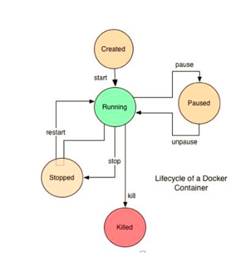

# 基本概念

## 重要网站
[docker 中文官网](http://www.docker-cn.com/)
[docker 英文官网](http://docker.com/)
[docker hub](https://hub.docker.com/)
[kubernetes 官网](https://kubernetes.io/)
[kubernetes api查询](https://kubernetes.io/docs/reference/)

## 技术基础
### cgroup
controller group 能够限制某个或某些进程的分配资源

### lxc
linux containers可以实现name space的隔离机制 和 cgroup的限额功能
是一个共享kernel的操作系统级别的虚拟化方法

### AUFS
能够透明地覆盖一个或多个现在文件系统的层状文件系统
> 比如说，你可能有一个可以作为很多不同容器的基础的CentOS的镜像，使用AUFS，只需要一个Centos镜像的副本就可以了

## 重要的组件

### Docker Image
1. 一个极度精简的linux的程序执行环境，比如Vi这种基本的工具是没有的
2. 需要定制化Build的一个安装包，包括基础镜像+应用的二进制部署包
3. Docker Image内不建议有运行期间需要修改的配置文件，正确的做法是将配置作为参数传给Image
4. Dockerfile用来创建一个自定义的image，包含用户指定的软件依赖
5. 当前目录下有Dockerfile，使用build命令来创建新的image
6. Docker Image的最佳实践之一是尽量重用和使用网上公开的基础镜像
7. docker image是一层一层地叠加起来的一个镜像
  

### Docker Container
1. 是Image的一个实例，相当于一个壳
2. 可以运行不同OS的Image
3. 不建议内部开启一个SSHD服务
4. 没有IP地址，通常不会有端口暴露的问题
5. 是一个封闭的沙箱
6. 使用Docker exec来进入沙箱
7. container的生命流程
  
### Docker Daemon
1. 创建和运行container的linux守护进程
2. 是Docker Container的Container
3. 可以绑定本地端口并提供Rest API服务，用来访问和控制

## Docker Registry
一个全球化的注册中心，叫做Docker Hub。是存放公开镜像的仓库。

## APP打包
Docker额外提供的Feature，标准统一的打包部署运行方案，层级化的image

## Docker全生命周期开发模式
开发，打包，部署，发布，测试